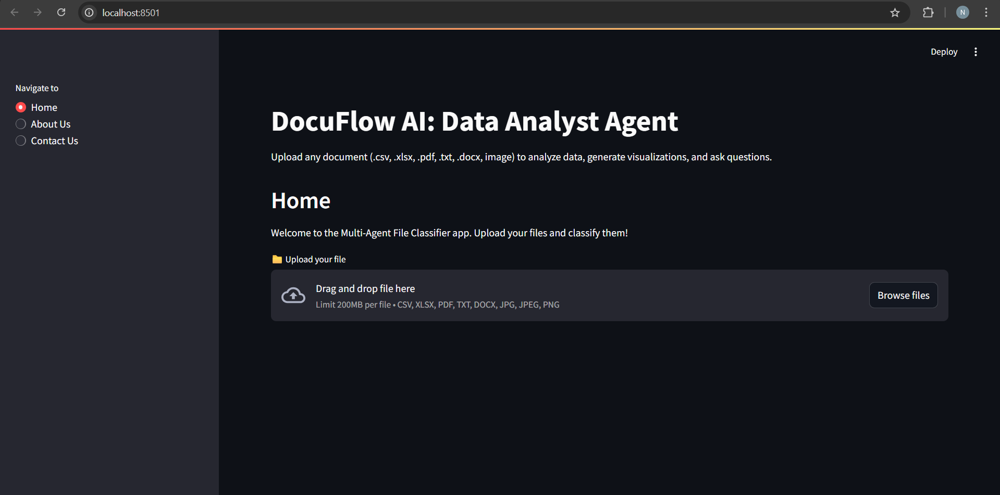
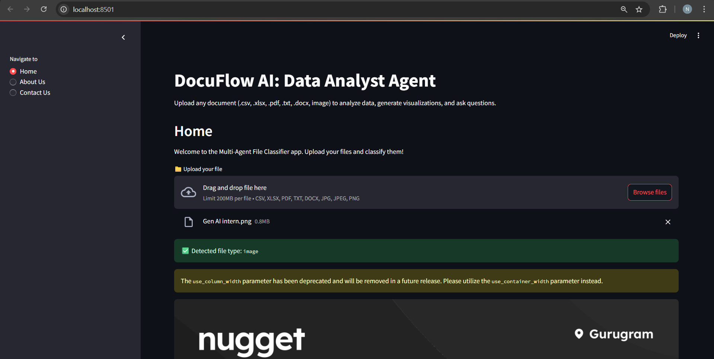
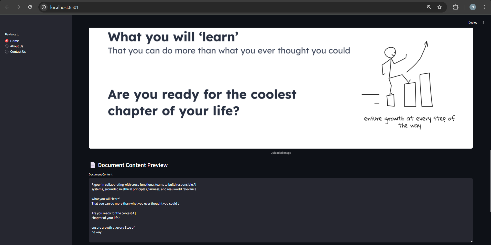
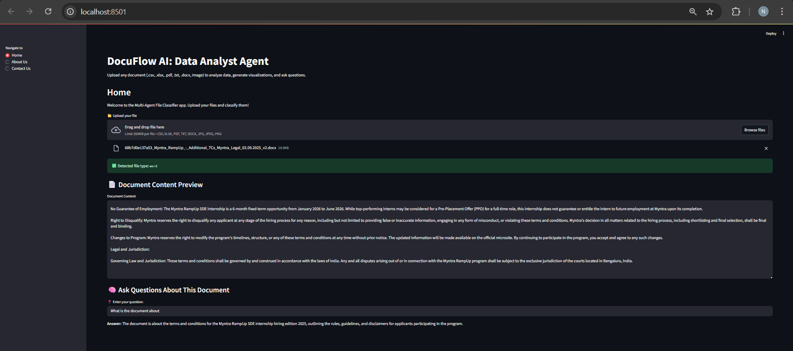
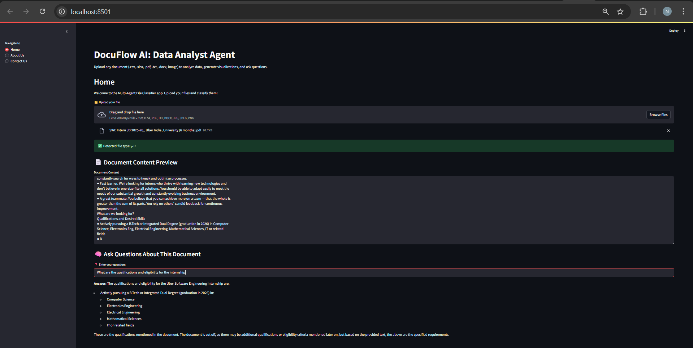
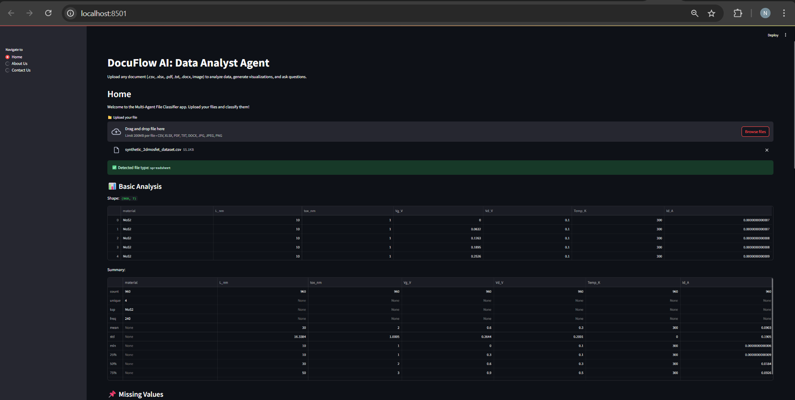
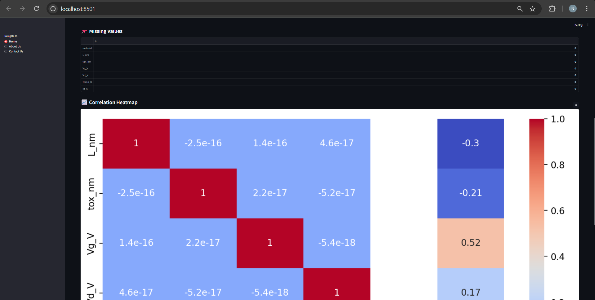
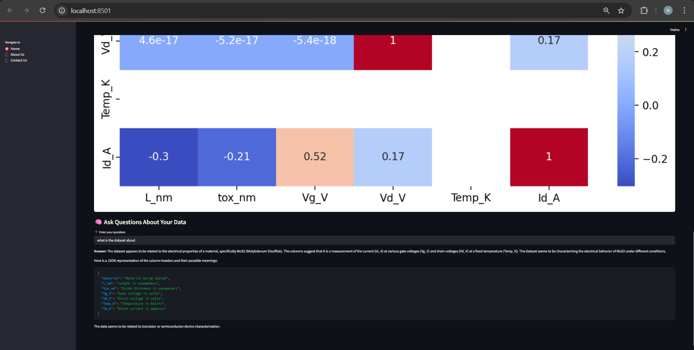

# 📊 DocuFlow AI: Built a Data Analyst Agent

**DocuFlow AI** is an intelligent document-understanding agent powered by LLaMA-4 Maverick (via Together.ai). It enables users to upload and analyze documents of various formats (including `.doc`, `.txt`, `.xlsx`, `.csv`, `.pdf`, and images) and interactively ask questions about the content. The agent can generate insights, perform visual data analysis, and support follow-up questions—all through the power of LLMs and data science.

---

## 🌟 Features

✅ **Multi-format Document Upload**  
- Supports `.doc`, `.txt`, `.xlsx`, `.csv`, `.pdf`, and image files (OCR-based for images)

✅ **Data Analysis & Insights**  
- Summarizes tabular data  
- Computes statistics (mean, trends, anomalies)  
- Generates visualizations (bar, line, pie, histogram, etc.)

✅ **Interactive Q&A**  
- Understands user queries about data  
- Handles follow-up questions in context  
- Supports natural language conversations

✅ **Model-Driven Intelligence**  
- Uses `meta-llama/Llama-4-Maverick-17B-128E-Instruct-FP8` from Together.ai  
- Hosted via [https://www.together.ai/](https://www.together.ai/)

---

## 🖼️ Screenshots & Demo

### 🔹 App Home  

---

### 🔹 Image Upload + OCR + Q&A  

---

### 🔹 Word Document Upload + Q&A  

---

### 🔹 PDF Upload + Q&A  

---

### 🔹 CSV Upload + Analysis + Q&A  

---

## 🎯 Use Case Examples

📝 Upload a CSV sales report and ask:
- "What was the total revenue last quarter?"
- "Which region had the highest returns?"
- "Plot monthly sales trend."
- "Now show average revenue per product."

📷 Upload a receipt image and ask:
- "What is the total amount?"
- "List the items purchased."

📄 Upload a PDF contract and ask:
- "What is the termination clause?"
- "Who are the signing parties?"

---

## 🛠️ Tech Stack

- **Python 3.10+**
- **Pandas / Numpy** — for tabular data handling  
- **Matplotlib / Seaborn / Plotly** — for visualization  
- **PyMuPDF, pdfplumber** — for PDF parsing  
- **pytesseract / EasyOCR** — for image text extraction  
- **docx / python-docx** — for Word document parsing  
- **Together.ai API** — LLaMA-4 Maverick Model

---

## 🧠 Model & API Requirement

> ✅ **Important**  
You **must** use the model: meta-llama/Llama-4-Maverick-17B-128E-Instruct-FP8

### 📞 Contact
 Name: Nayan Kathait

 Email: nayankathait@gmail.com

 GitHub: Nayan1801
